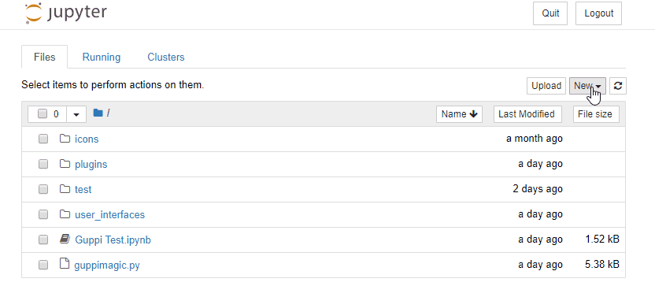
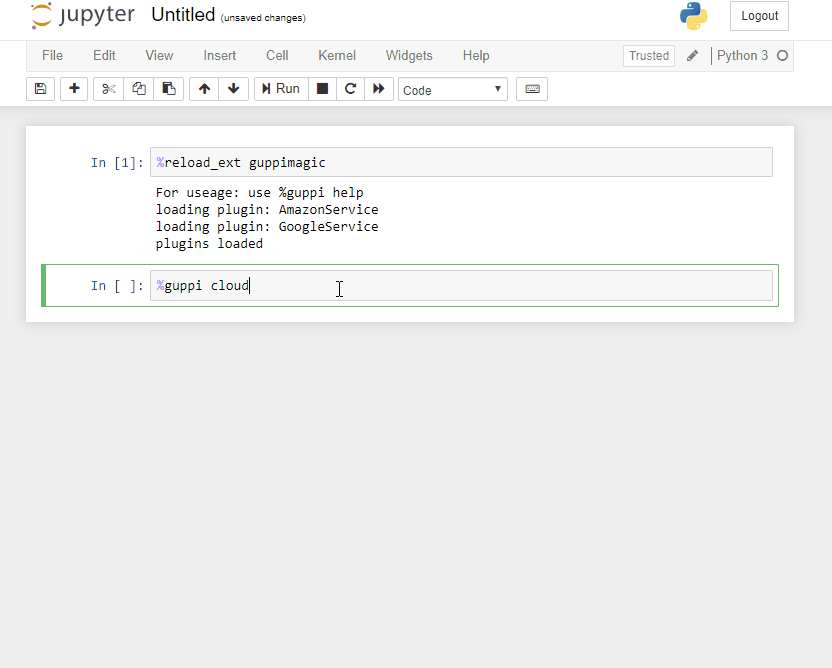

<p align="center">
  
</p>

# Project GUPPI

A unified platform for data scientists to easily access all the services they need within Jupyter Notebook. 

Currently our most key feature is the ability to display and interact with cloud virtual machine instances across different cloud providers at once. We support Amazon EC2 and Google Compute. Users can start/stop, restart, terminate, and group instances. Users can easily SSH into groups of instances and run commands accross multiple services at once.

## Getting Started

These instructions will get you a copy of the project up and running on your local machine.

### Prerequisites
Ensure the following are installed on your machine:

* [Jupyter Notebook](https://jupyter.org/install)

Installing Jupyter using the Anaconda Distribution is ideal, as it includes Python along with other commonly used packages for data science

* [Python (3.3 or greater)](https://www.python.org/downloads/)
To check if you have python installed, type `python --version`

* pip (should should be installed along with Python but to check, type `pip -V`)

* [git](https://git-scm.com/downloads)

### Installation


#### Clone project guppi to a directory of your choice
Make sure to put it somewhere you can easily access again, as you will need to add files to GUPPI during setup and run notebooks from within this folder

```
git clone https://github.com/katekaho/project-guppi.git
```

#### Move into guppi directory

```
cd project-guppi
```
#### Pip install the required Python packages
If you have both Python 2 and 3 installed, you may have to type pip3 instead of pip

```
pip install -r src/setup/req.txt
```

#### Open Jupyter Notebook

```
jupyter notebook
```

#### Create a new Python3 notebook


#### Load our GUPPI extension by typing the following iPython magic command into a cell and running it. (note: currently, our extension needs to be run inside the project-guppi folder)
```
%reload_ext guppimagic
```

#### For the list of commands to run, type %guppi help

#### Follow the configuration instructions for the cloud services. You can view the instructions in the ``%guppi cloud multicloud`` command or through viewing the md files in the ``plugins`` folder of the service you want 
Once everything is properly configured, you'll be able to view and run commands on your cloud instances 🎉




## Contributing

Please read [CONTRIBUTING.md](https://github.com/katekaho/project-guppi/blob/master/CONTRIBUTING.md) for details on our code of conduct, and the process for submitting pull requests to us.

## Authors

* **Joseph Aronson** - *Initial work* - [joeyaronson](https://github.com/joeyaronson)
* **Japheth Frolick** - *Initial work* - [japhyf](https://github.com/japhyf)
* **Kate Miller** - *Initial work* - [katekaho](https://github.com/katekaho)


## Acknowledgments

Cisco Security Business Group
* Subharthi Paul
* Nancy Cam-Winget
* Oleg Bessonov
* Saman Taghavi Zargar

Jack Baskin School of Engineering Staff
* Richard Jullig
* Patrick Mantey
* Reihaneh TorkzadehMahani 
* Morteza Behrooz
